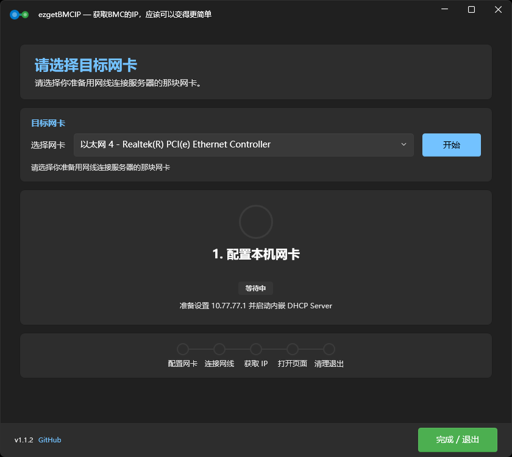

# IPMI/BMC 直连助手

<p align="center">
  
</p>

ezgetBMCIP

用于笔记本直连服务器 IPMI/BMC 管理口时，临时给本机网卡配置地址，启动内置 DHCP 服务，等待 BMC 获取地址后打开管理页面。

主线版本面向 Windows 10/11；Legacy 版本面向 Windows 7 SP1 / Windows 8 / Windows 8.1。

<p align="center">
  
</p>

## 使用提示

运行后选择网卡 → 连接 IPMI/BMC 管理口 → 等待页面打开 → 操作完成后点击"完成 / 退出"。

- 程序退出前会**恢复所选网卡为 DHCP**，不会恢复为原来的静态 IP 配置。
- 需要**管理员权限**，启动时自动 UAC 提权。
- 确保网线插在服务器的 **IPMI 专用管理口**，不是普通网口。

## 功能

- 🖥️ 检测有线网卡，多网卡时可选
- 📝 退出时恢复所选网卡为 DHCP 模式
- 🔧 临时配置本机为 `10.77.77.1/255.255.255.0`
- 📡 内嵌轻量 DHCP Server（直连场景固定分配 `10.77.77.100`）
- 🧭 可自定义私有网段：仅允许 `10.x.x.x`、`172.16-31.x.x`、`192.168.x.x`，避免公网地址被代理或路由策略干扰
- 🔗 WMI/CIM 轮询网卡链路状态
- 🌐 获取 IPMI IP 后调用浏览器打开 BMC 页面
- 🧹 关闭时停止 DHCP Server、恢复所选网卡为 DHCP
- 🪜 5 步可视化进度指示，失败时明确提示
- 🌗 自动跟随 Windows 系统亮/暗主题

## 工作流程

| 步骤 | 说明 |
|---|---|
| 1. 配置本机网卡 | 设为 10.77.77.1 → 启动 DHCP |
| 2. 连接网线 | 等待网线插入 IPMI 管理口，检测 Link UP |
| 3. 获取 IPMI IP | DHCP 监听 IPMI 请求，自动获取地址 |
| 4. 打开 BMC | 使用浏览器打开 `http://<IPMI IP>` |
| 5. 清理退出 | 关闭 DHCP Server，恢复所选网卡为 DHCP |

## 自定义网段规则

默认网段为 `10.77.77.1/24`，BMC 固定分配为 `.100`。如果需要避让本机已有网段，只能改为私有 IPv4 网段：

- `10.x.x.x`
- `172.16.x.x` 到 `172.31.x.x`
- `192.168.x.x`

不要使用 `102.x.x.x` 这类公网地址段；在部分 Windows、浏览器或代理环境下，请求可能被按公网流量处理，导致页面打不开或出现 HTTP 502。

## 下载

每次 Release 提供多个下载包：[📥 下载页](https://dl.fayoo.fun) / [GitHub Releases](https://github.com/FAYOO777/ezgetBMCIP/releases)

| 版本 | 说明 |
|---|---|
| **Full** `ezgetBMCIP-full.zip` | 面向 Windows 10/11，包含 .NET 运行时，解压后运行，文件较大 |
| **Lite** `ezgetBMCIP-lite.zip` | 体积小，下载快，解压后运行，需要系统装有 .NET Desktop Runtime 8.0 |
| **Legacy** `ezgetBMCIP-legacy-net46.zip` | 面向 Windows 7 SP1 / Windows 8 / Windows 8.1，压缩包内含 .NET Framework 4.6 离线安装包，解压后运行文件夹内的 exe |

## 技术栈

- .NET 8 WPF
- [WPF-UI 4.x](https://github.com/lepoco/wpfui)
- WMI / CIM（网卡检测、链路状态）
- 内嵌轻量 DHCP Server

## 编译 & 发布

```powershell
# 编译
dotnet build -c Release

# 发布 Full 版（自包含）
.\scripts\publish-full.ps1

# 发布 Lite 版（框架依赖）
.\scripts\publish-lite.ps1
```
